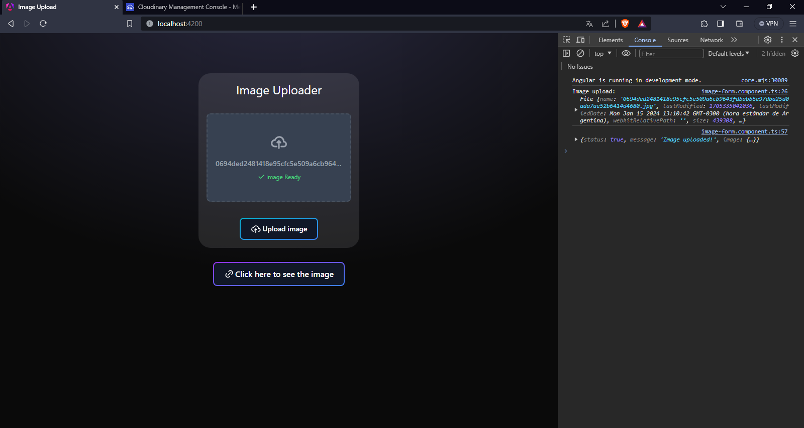

# Angular Image Upload to Cloudinary with Node.js and Express

This example shows how to upload images from an Angular front-end application to a back-end server made with Node.js and Express, and then upload them to Cloudinary. It is important to create a Cloudinary account and provide your credentials in a `.env` file inside the `backend` folder, which will be automatically exported by the `config.js`.

## Prerequisites

Before getting started, ensure that you have the following installed:

- Node.js version 20.0.0 or later
- Angular CLI version 17.0.0 or later

## Setup

1. Clone the repository:

   ```bash
   git clone https://github.com/Martinchx/Angular-Express-Cloudinary-Upload.git
   cd Angular-Express-Cloudinary-Upload
   ```

2. Install dependencies for both the Angular front-end and Node.js back-end:

   ```bash
   cd frontend
   npm install
   cd ../backend
   npm install
   ```

3. Create a `.env` file in the `backend` directory and add your Cloudinary credentials:

   ```env
   CLOUDINARY_CLOUD_NAME=your_cloud_name
   CLOUDINARY_API_KEY=your_api_key
   CLOUDINARY_API_SECRET=your_api_secret
   ```

## Usage

1. Start the Node.js server:

   ```bash
   cd backend
   npm run dev
   ```

   The server will be running at `http://localhost:8080`.

2. In a separate terminal, start the Angular development server:

   ```bash
   cd frontend
   ng serve
   ```

   The Angular app will be available at `http://localhost:4200`.

3. Open your web browser and navigate to `http://localhost:4200`. You should see the Angular app with a file input for uploading images.

4. Select an image using the file input and click the "Submit data" button. The image will be uploaded to Cloudinary via the Node.js server.

## Additional Notes

- Ensure that your Cloudinary account has been set up and that you have the correct credentials in the `.env` file.
- The `config.js` file in the `backend` directory automatically exports the Cloudinary credentials from the `.env` file.


